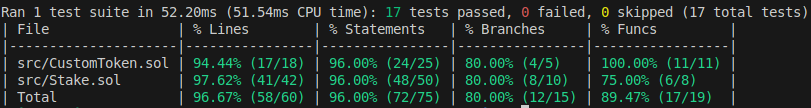

#### Creating a ERC20 Token 'HIMAL(HIM)' using Foundry and OpenZepplin

## Foundry

**Foundry is a blazing fast, portable and modular toolkit for Ethereum application development written in Rust.**

## Documentation

**Created an ERC20 token HIMAL(HIM) using OpenZepplins ERC20 contract. This contract contains the follwoing features:**
 
 1. Create a HIMAL(HIM) ERC20 token with desired initial supply.
 2. Proivde **(HIM)** tokens as block reward to miners.
 3. Has Custom Token Burning Feature.
 4. Can trasnfer **HIM** tokens from one address to another addres with certain minimum amount limit.
 5. Staking Feature with 1 day minimum staking time.

### Testing Coverage

## Testing Documentation
*Used addressed provided by Anvil. If this contract is to be deployed to a live network or a testnet, use addresses accordingly.*
**Before beginning testing, start an live anvil chain on one terminal and begin testing from another terminal**

Tested for the following things:
1. Whether the sender and receiver address are correct or not.
2. The transaction reverts if minimun transaction amount is not sent.
3. Check balance of both sender and receiver after a transaction.
4. Checking Burning Functionality.
5. Checking Revert token Burning if address has less than burn amount.
6. If miners are rewarded or not.
7. Staking address is set or not.
8. Whether the staking operation reverts if not enough HIM tokens are sent.
9. If wrapper.burn is called and tokens are burned or not.
10. If staked address is pushed into the saking address array.
11. If staking amount is mapped to staking address / checking mapping functionality.
12. If staking time is stored or not.
13. Testing an emit function.
14. Checking "CheckUnstakingAddress" Function.
15. Checking if Unstake reverts if Invalid Unstaking Address is passed.
16. Checking if Unstake reverts if Staking Time is less than Specified Minimum Time.
17. Fully Testing Unstake function by checking if balances are updated or not after unstaking operation is completed.

